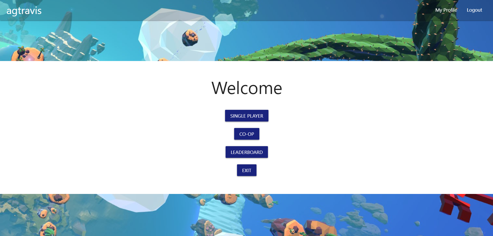

# RINQYDINK

This is an app based on classic video game arcades from the 80s & early 90s. Kids used to come to play games, yes, but also to socialize and get human interaction. In the days of headsets, high-tech games, and high-speed internet connections, this app hopes to encapsulate the magic of an era lost to history along and combine it with the connectivty of today. Users are able to create their accounts and therefore compare high scores, and interact with eachother in real time either by playing multiplayer or simply using the chat feature.

Check out the repo [here](https://github.com/FrantzCFelix/RINQYDINK), and see the app in operation [here](**************).

This app runs in the browser - see [Setup](#setup) below for instructions on how to use.

## Table of contents

- [Screenshots](#screenshots)
- [Technologies](#technologies)
- [Code Examples](#code-examples)
- [Setup](#setup)
- [Features](#features)
- [Status](#status)
- [Contact](#contact)

## Screenshots

## Technologies

Here are the package.json dependencies:

    "dependencies": {
        "bcryptjs": "^2.4.3",
        "express": "^4.17.1",
        "express-handlebars": "^3.1.0",
        "express-session": "^1.17.0",
        "mysql2": "^2.1.0",
        "passport": "^0.4.1",
        "passport-local": "^1.0.0",
        "sequelize": "^5.21.5",
        "socket.io": "^2.3.0",
        "socket.io-client": "^2.3.0"
    }

This package was written in JavaScript using Node.js, and uses `MySQL` (via `sequelize ORM`) to interact with the database. If the GitHub repo is forked, in order to edit the code the user can run `npm i` to install these dependency. `Express` is the module used to create a server, and `express-handlebars` is how the content is being dynamically displayed through a view engine. `materialize-css` works with the front end to style the web-page. `socket.io` and `socket.io-client` are to support the chat window.

All other dependencies not mentioned are related to creating and saving user details either in the database permanently, or in the client for the length of the session, and utilise `bcryptjs` to protect passwords.

The app is hosted via `Heroku` in order to facilitate the necessity of running a live server.

The game engine used is an API - `Phaser 3`, and this enables the app to animate and controll sprites, and at the same time write the games entirely in JavaSCript, mostly using classes.

## Code Examples

To start, let's look at some of the `CRUD` operations:

### Create

This happens in two seperate occasions, for two different tables. Both when a user signs up for a new account, and when a new score is created. The user signing up is by far more interesting:

    function signUpUser(username, password) {
        $.post(`/api/signup`, {
            username,
            password
        })
        .then(() => {
            window.location.replace(`/members`);
        })
        .catch(handleSignupErr);
    }

This is the API request that handles the form submission. The object `post`ed to the router is the username and password the user has entered (code not shown) in fields on screen. In the router:

    app.post(`/api/signup`, (req, res) => {
        db.User.create({
            username: req.body.username,
            password: req.body.password
        })
        .then(() => {
            const statusCode = 307;
            res.redirect(statusCode, `/api/login`);
        })
        .catch(err => {
            const unauthenticatedStatusCode = 401;
            res.status(unauthenticatedStatusCode).json(err);
        });
    });

we can see that the `create` method is applied passing the properties of the object that was passed. In the ORM (`sequelize`) for the model that represents the table in `MySQL`:

    User.addHook(`beforeSave`, user => {
        const rounds = 10;
        user.password = bcrypt.hashSync(
            user.password,
            bcrypt.genSaltSync(rounds),
            null
        );
    });

(this is not the whole model, just the relevant part) we can see that a hook is added (this is a method of waiting for an appropriate point in the process to run specific code) to take a value and encrypt it, using `bcrypt`. A prototype function exists in this model to be able to compare a user input password during login to the encrypted password saved in the database as well.

If successful in the sign up, back in the API AJAX request, the user is then redirected to the `/members` route, and we can follow the `Read` part of `CRUD`.

### Read

The `get` part of the above flow is actually pretty straightforward, so instead of demonstrating that, here is a more complicated `get` involving a join and an object being passed to the view engine:

    app.get(`/leaderboard`, isAuthenticated, (req, res) => {
        db.HighScore.findAll({
            include: [db.User],
            order: [[`score`, `DESC`]],
            raw: true
        }).then(dbScore => {
            const highScoresObj = {
                highScores: dbScore
            };
            res.render(`leaderboard`, highScoresObj);
        });
    });

This `get` route is accessed when either the user chooses to view the Leader Board page, or when they finish a game and their score is logged to the database they are redirected to this page automatically. The `HighScores` table (factoring in sequelize's auto pluralizer) has a `findAll` method run on in. The first property is the `JOIN`, and since this table has a foreign key representing the ID column of the `Users` table, this is `include`d here. The `order` property is because we want scores to be displayed with the highest at the top, and `raw: true` means we only get returned the literal content of the table - no other information which is not be useful for our purposes.

Next, the returned object, an array, has to be itself placed inside an object so it can be sent to the view engine to be rendered with `leaderboard` (a string representing a `.handlebars` file). In the handlebars file:

    <ol>
        {{#each highScores}}
        <li data-id="{{id}}">
            {{'User.username'}} scored {{score}}
        </li>
        {{/each}}
    </ol>

an ordered list generates a list item for each object that exists within the array that was passed, forming a simple concatenation that is displayed in the browser.

### Update

Next in our `CRUD` is update. There is only one instance of this app using this, and that is where a user wants to change their password:

It starts with an API `PUT` AJAX request, that passes the new password to the router, and then reloads (technically redirects)the page. In the router:

    app.put(`/api/reset`, (req, res) => {
        const userData = {
            password: req.body.password
        };
        const rounds = 10;
        userData.password = bcrypt.hashSync(
            userData.password,
            bcrypt.genSaltSync(rounds),
            null
        );
        db.User.update(userData, {
            where: {
                id: req.user.id
            }
        }).catch(err => {
            const unauthenticatedStatusCode = 401;
            res.status(unauthenticatedStatusCode).json(err);
        });
    });

briefly, the passed new paweors is stored in a new object that will match the database model requirements. The password is then encrypted in a similar fashion to the `hook` in the model, and then the sequelize `update` query is run.

### Delete

Finally let's look at a delete. If the user clicks on a delete button for a high score (which will only be shown next to their own high scores, they cannot delete other user high scores), they an API `DELETE` request is made. In the router:

    app.delete(`/api/highscores/:id`, (req, res) => {
        db.HighScore.destroy({
            where: {
                id: req.params.id
            }
        }).then(dbScore => {
            res.json(dbScore);
        });
    });

`destroy` is the method used to identify the specific record of the `HighScores` table. For this route, instead of passing the ID of the record as part of the object (`req.body.id`), the ID is passed using the parameters variable (`/:id` == `req.params.id`).

## Setup

## Features

## Status & Future Developement

## Contact

Created by [@agtravis](https://agtravis.github.io/) | [@agtravis](https://agtravis.github.io/) | [@agtravis](https://agtravis.github.io/)
